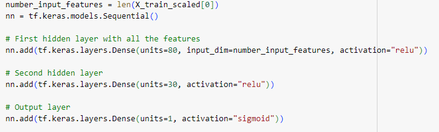
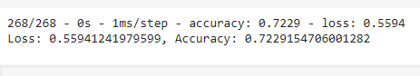
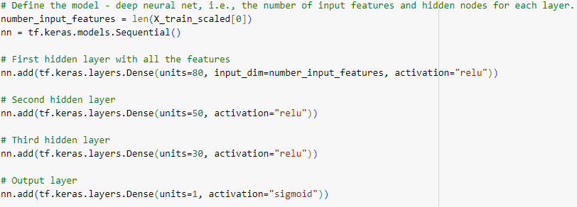
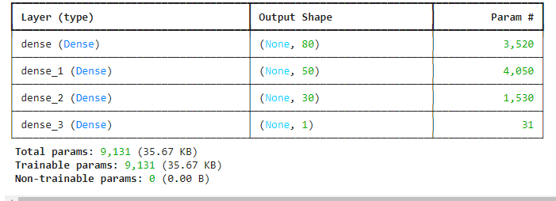
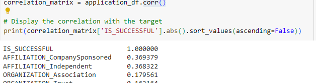
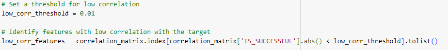
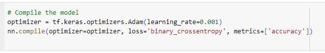
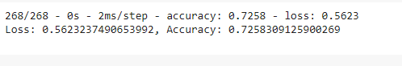

<h1 align="center">Predict chance of success  ventures </h1>
<h3 align="center">Alphabet Soup Charity</h3>
<h3 align="center">Deep Learning Model</h3>

	

## Overview
This project is focused on developing a deep learning model to assist the nonprofit organization Alphabet Soup in selecting funding applicants who have the highest likelihood of success. Using historical data, we aim to build a binary classifier that predicts the success of applicants based on various features.

## Data Preprocessing
- Target Variable: 
IS_SUCCESSFUL - This column indicates whether an applicant was successful.
- Feature Variables:
APPLICATION_TYPE, AFFILIATION, CLASSIFICATION, USE_CASE, ORGANIZATION, STATUS, INCOME_AMT, SPECIAL_CONSIDERATIONS,ASK_AMT 
- Removed Variables:
The EIN and NAME columns were removed because they are identification variables and do not contribute to the predictive analysis.

## Compiling, Training, and Evaluating the Model
- Neurons: In the input layer used 80 neurons since there are 43 input features. 
- Layers: 3 Layers, include a hidden layer to optimize the model.
- Activation: ReLU (ReLU's combination of simplicity, efficiency, and effectiveness in mitigating the vanishing gradient problem makes it a strong choice for many deep learning models)
- Target model performance : Initial accuracy achieved was approximately 72.54%, which did not meet the target accuracy of 75%.
- What steps did you take in your attempts to increase model performance : Try to optimize the model as follows.

## Model Architecture:

### Initial Model

	

#### Model Performance:
- Number of epochs=100

	

Initial accuracy achieved was approximately 72.54%, which did not meet the target accuracy of 75%.

## Feature Engineering: 
Tested different feature engineering techniques, such as binning rare categorical variables.
## Model Tuning:
Adjusted the number of neurons and layers, and experimented with different activation functions and the number of epochs.

## Optimizations Model Architecture:

### First optimization Attempt 
Add another hidden layer to the model with 30 inputs.  Reduce the number of epochs to 50 since in the initial model training ,
it was noticed that model came to optimal solution during the epochs 40-50

	

#### Model Performance:
  - Number of epochs=50
  

	

### Second optimization Attempt 
Try to reduce the features that not significantly influence the target using corr function. 

	

	

#### Model Performance:
  - Number of epochs=50
  

	

### Third optimization Attempt 
Compile the model with Adam optimizer and a learning rate

	

#### Model Performance:
  - Number of epochs=50
  

	

## Summary
The deep learning model demonstrated an accuracy of 72.54%, slightly below the target of 75%. 
While the model showed potential, further optimization and feature engineering are necessary.

## Recommendation for Alternative Model
Considering the complexity and nature of the data, 
a Random Forest classifier could be an alternative model to explore. Random Forests are robust to over fitting and can handle a large number of input features, potentially improving accuracy.

